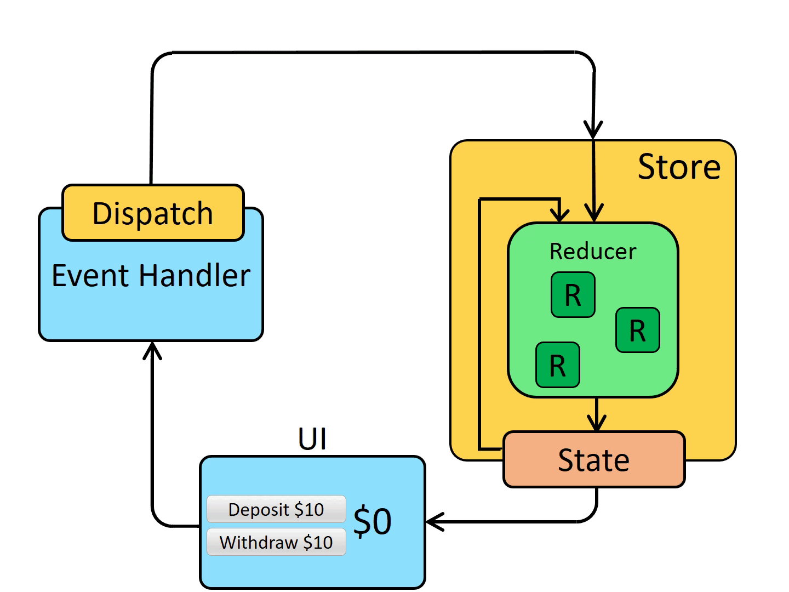

# Redux Setup

- **Create a Redux store with `configureStore`**
    - `configureStore` accepts a `reducer` function as a named argument
    - `configureStore` automatically sets up the store with good default settings

- **Provide the Redux store to the React application components**
    - Put a React-Redux `<Provider>` component around your `<App />`
    - Pass the Redux store as `<Provider store={store}>`

- **Create a Redux "slice" reducer with `createSlice`**
    - Call `createSlice` with a string name, an initial state, and named reducer functions
    - Reducer functions may "mutate" the state using Immer
    - Export the generated slice reducer and action creators

- **Use the React-Redux `useSelector/useDispatch` hooks in React components**
    - Read data from the store with the `useSelector` hook
    - Get the `dispatch` function with the `useDispatch` hook, and dispatch actions as needed.

# One Way Data Flow
One way data flow discribes the sequence of steps to update the state.

# Summary
**Redux is a library for managing global application state**
- Redux is typically used with the React-Redux library for integrating Redux and React together
- Redux Toolkit is the standard way to write Redux logic

**Redux's update pattern separates "what happened" from "how the state changes"**
- `Actions are plain objects` with a `type` field, and describe "what happened" in the app
- `Reducers` are functions that `calculate a new state` value based on `previous state + an action`
- A `Redux store runs the root reducer` whenever an `action is dispatched`

**Redux uses a "one-way data flow" app structure**
- State describes the condition of the app at a point in time, and `UI renders based on that state`.
- When `something happens` in the app:
    - The `UI dispatches` an action.
    - The `store runs the reducers`, and the `state is updated `based on what occurred.
    - The `store notifies the UI` that the state has changed.
- The `UI re-renders` based on the new state.
